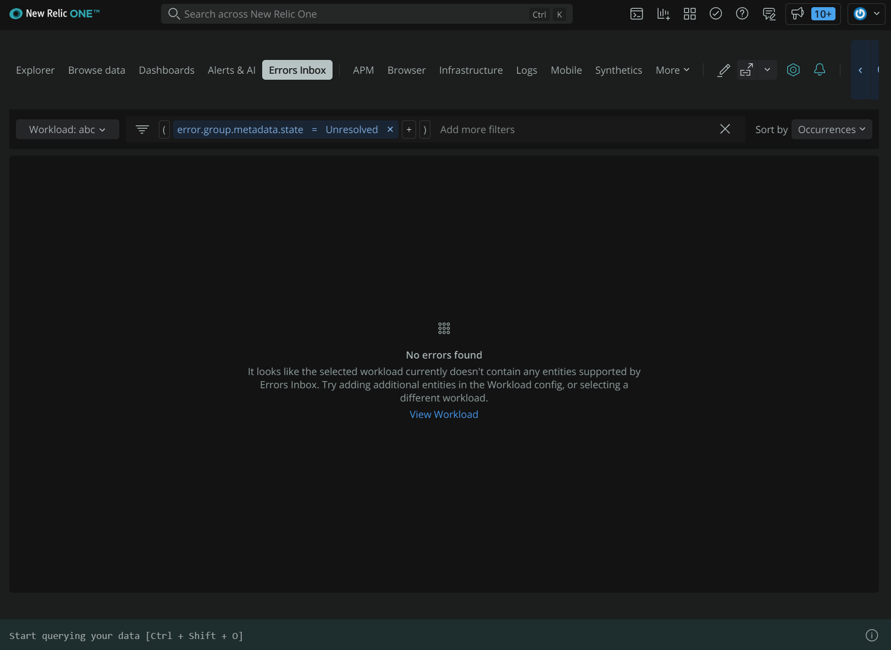
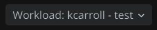
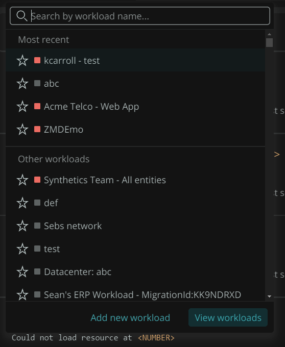
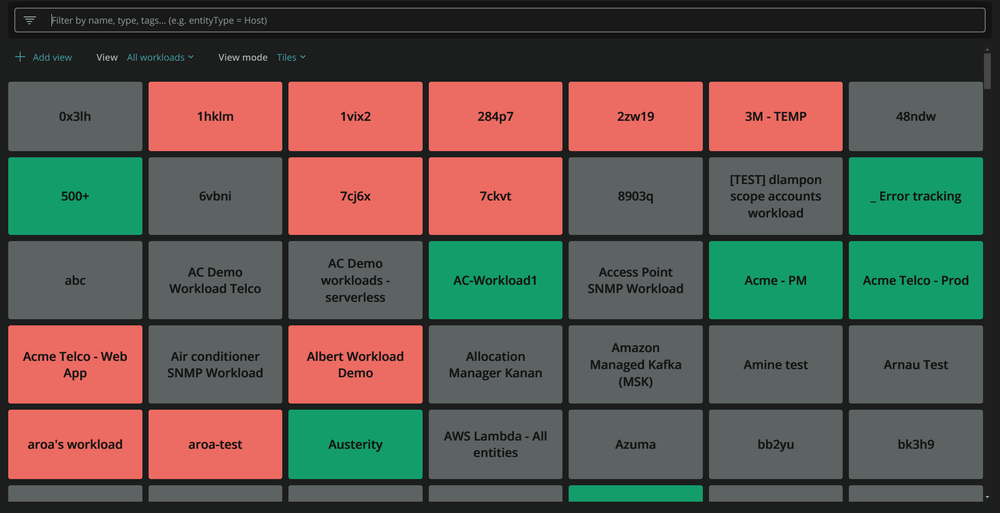
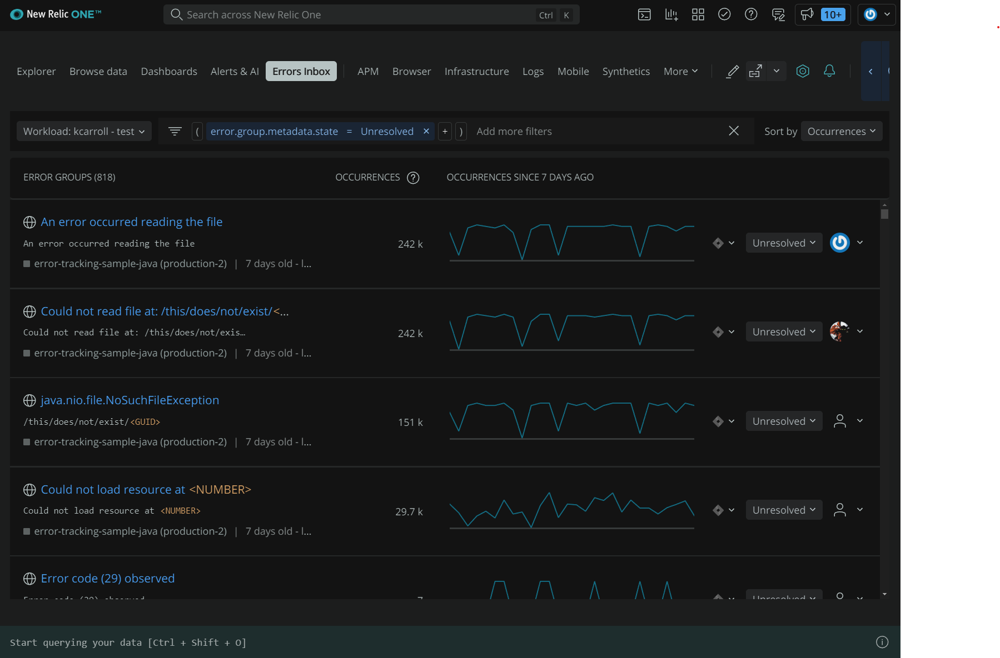
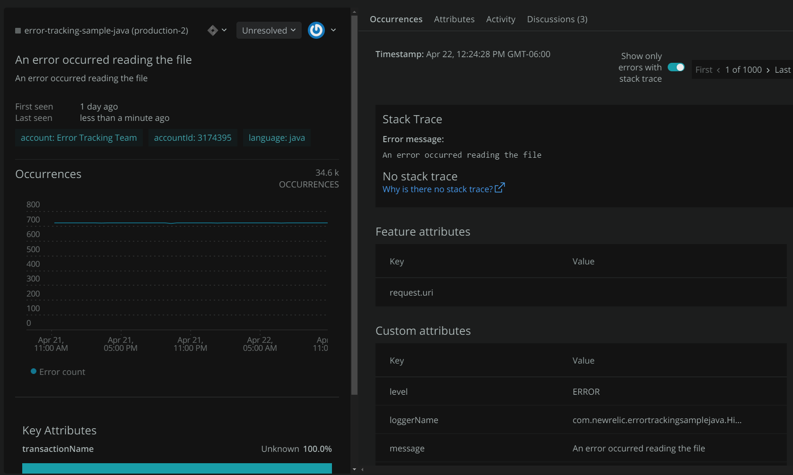
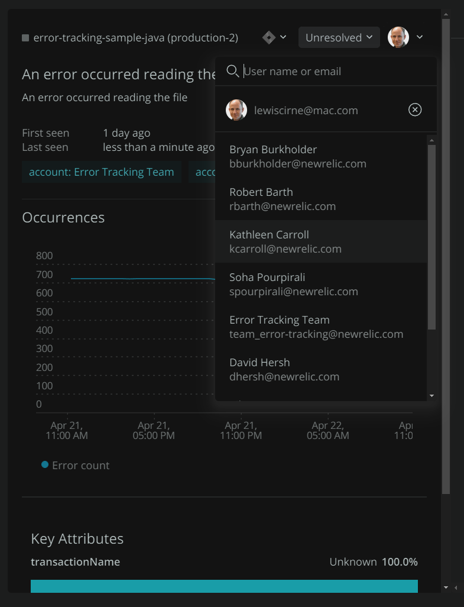
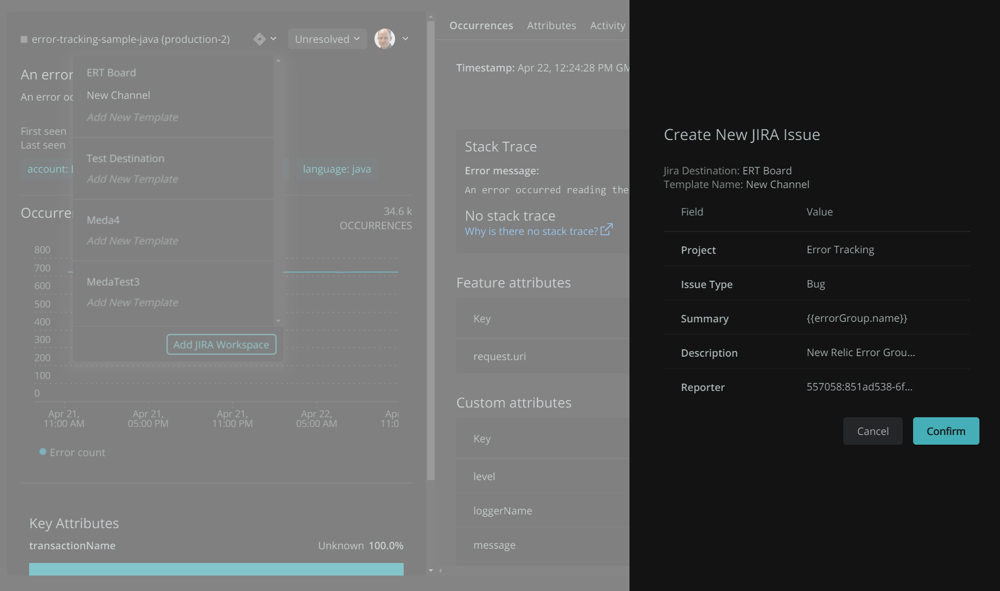
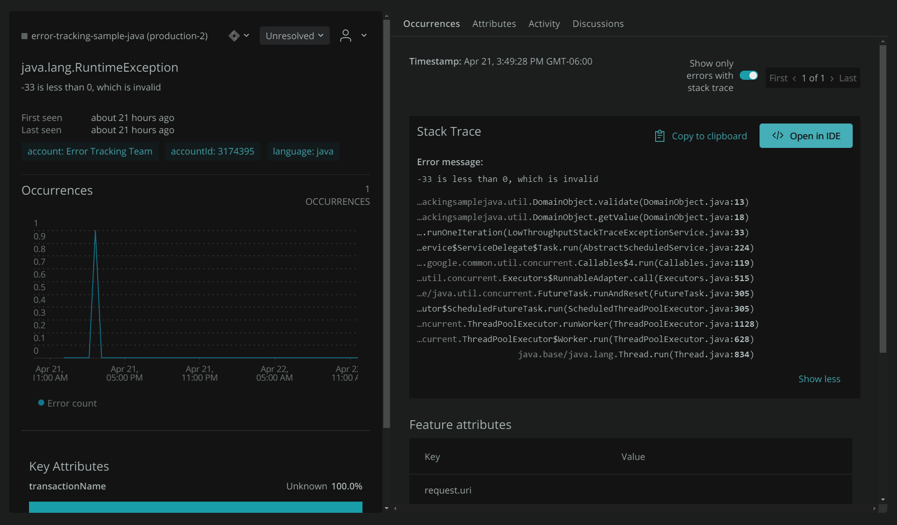

One of the most exciting things about being a developer is working on new, interesting features, but unfortunately, many developers spent the majority of their time responding to incidents and battling technical debt rather than writing new code.

At New Relic, our goal is to help you respond to incidents so you can focus on the work you love most. In this post, we’ll show you how to use errors inbox, workloads, CodeStream, and New Relic’s Jira integration to help prioritize, organize, and resolve errors and proactively improve the reliability of your system with each sprint cycle.

## Step 1: Organize your architecture with workloads

[Errors inbox](https://docs.newrelic.com/docs/errors-inbox/errors-inbox/) offers a comprehensive view of all errors across your stack, collating the data from APM, Browser, mobile, and serverless sources into a single view. It then allows you to search, triage, assign, discuss, and resolve errors, all from one place.

Errors inbox can thus form the backbone of your sprint planning. Let's take a look at how that might look. As you go into sprint planning, you open your Errors inbox:

Everything seems to refer to workloads. This is because workloads are the mechanism that Errors Inbox uses to group and to organize errors. They are defined via a simple dialog, and depend on tags on your entities in order to group the entities into workloads. By applying different tags to your environment resources, you can create workloads that group them in whatever ways that make sense for your needs.

On the top-left of the page, there is a dropdown, , with which you can choose the *workload* that is currently relevant. Workloads are a means of grouping errors in a manner that is appropriate to your system, architecture, or needs. They are based on the tags that have been applied to the entities in your environment, and can be defined from that same dropdown, using the `Add Workload` button. The default workload simply includes all of the entities in the environment. For small environments, this makes sense, but as you grow, you will probably want to segment your workloads into logical groups.

Once you have defined workloads, you can select the `View Workloads` button from the workloads dropdown, to see a high level status of all of your workloads:

The view from that page is useful for a high level impression or monitoring of your systems, letting you know which areas are experiencing errors at a glance:

The other use of workloads is to view the errors that are happening within an existing workload. This is what you will do when you are sprint planning.

## Step 2: Build a better backlog with errors inbox

From the main Errors inbox page, you should select the appropriate workload from the dropdown in the top-left. After doing that, New Relic One will load all of the errors, according to the defined filter(s), for that workload. By default, this means all of the *unresolved* errors for that workload.

This view is showing all of the currently unresolved errors, sorted by the total number of occurrences, in descending order. This application has a lot of errors, and some of them appear to be happening quite frequently.

You can click on that first one, `An error occurred reading the file`, and you will get more detail:

At this point, there is enough information already available to start discussing this error with the everyone involved in the sprint planning. You can see the impact of the error, as well as whatever information was collected about error context, such as attributes that might have been collected with the error, or if there is a stack trace, what it looks like. You know how often it is occurring, as well.

## Step 3: Delegate work to be done

If it is something that should be worked on in this sprint, it can be assigned from this same page, using a convenient dropdown:

In addition, the JIRA integration, which is also accessible via a dropdown, lets you create the JIRA issue to track this bug, right from this same interface.

As a team, you can quickly identify the major errors that are affecting your areas of responsibility, triage them, and assign them, without ever leaving the Errors inbox.

Assign tickets using the Jira integration. After a plan is established, tickets can be created and assigned to members of your team via the Errors Inbox Jira integration. We also store links to your tickets alongside associated error groups for a period of time. If an error occurs again in that period, you can easily access associated tickets.

## Step 4: Take your planning into your IDE with CodeStream

The integration between Errors inbox and your work does not end with triaging and assigning issues to work on. Errors inbox also integrates with the [CodeStream](https://newrelic.com/codestream) browser plugin.

When viewing an error that has a stack trace, you will also see a `View in IDE` button alongside that stack trace. You will also see

If you have installed the CodeStream extension into your IDE, and you have access to the repository for the code that is throwing exceptions into Errors inbox, clicking on that button will take you right to the root of the error within your IDE. This integration makes it very convenient for developers to quickly move to where they need to be within the code to work on their assigned errors.
