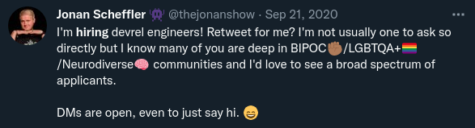

My first introduction to computer programming was through my friend Trevor. His father purchased a TRS-80 Model I computer. I was fascinated because not only could you play games on it that you could not play with the Magnavox Odyssey 2, but you could also write programs. If you typed the right words, the computer would do what you told it to do. I was hooked.

Within the next couple of years I took a summer enrichment class at my local college where I got to use a "big" multiuser computer system (I believe that it was a PDP-11 system, but my memory around that is a bit fuzzy) to write a moon lander game, and then not long after that, my parents bought an Apple ][+ computer. It was ostensibly a computer for the whole family, but it quickly turned into my computer.

I learned everything about that system. I wrote games in Applesoft Basic, but a persistent challenge was memory. Even with a 16k expansion card, I was limited to a total of 64k of RAM, which was shared by the operating system code, and display mapped regions of memory. This meant that it was very easy to run out of memory when writing programs in applesoft basic. The alternative was to write code in the 6502 processor's native instruction set. I literally learned to write programs that were composed of nothing more than hexadecimal codes. Instead of writing `LET X = 0`, I could write something like `A9 00 8D 00 03`. I went on to discover the built-in mini-assembler that was part of the operating system, which let me write machine code programs that were composed of mnemonics like `LDA #$00` and `STA $0300`. It was amazing. I knew those early Apple systems as deeply and as intimately as it was possible to know them.

But technology changes. It evolves. Eventually I left the Apple ][ world behind. I discoverd VAX/VMS systems. I wrote crazy things in DCL, and I taught anyone who was around me who wanted to learn what I knew about all of this. My friends and I ran and hacked on an installation of [Monster](http://www.skrenta.com/monster/), which was one of the very first multiplayer games where the players could alter the game world. I learned of Unix systems, and I started running Linux starting from some of the very earliest kernels in mid 1992 (0.95ish). I made a living managing RS6000 AIX (unix) systems, and MSDOS/Windows systems. The world was changing. C, Perl, TCL, mSQL (the predecessor of MySQL), PHP, HTML, CGI, and other technologies were all born in this time, and I learned them all.

I got tired of being poor, and discovered that all of this was marketable knowledge. I worked as tier 2 technical (unix) support for engineers using Sun Microsystems hardware, and then did systems administration in that same environment. I learned Java. I actually wrote a system that could render all of HTML markup in a Java canvas, inside of a browser, including the form elements, but that also supported bidirectional communication with the CGI-server, and would _update the page elements without rerendering the whole thing_, shortly after Java 1.0 was released. i.e. basically how everyone does web applications now, albeit with Javascript.

Things kept evolving and changing, and I did, as well. I moved over to software engineering in the internet startup world of the mid-later 1990s. I wrote a lot of intense, "high performance" Perl. I built wild libraries, including a complete exception system for Perl to make my code cleaner. I wrote a version control system in Perl that sat on top of CVS and force a branch-work-merge workflow (i.e. what is ubiquitous now with Git based development flows), and made this the standard for the engineering team that I was on. I nurtured junior developers (one of whom, 10 years later, became my boss for a while).

Onward rolled the world, and onward rolled technology. Perl gave way to Ruby. People collaborated via the internet more than ever before. I spent immeasurable hours learning from others, and helping others to learn online. Eventually I started writing actual articles, and talking at conferences. I became the maintainer of Ruby 1.8.6. Thank goodness for learning machine code fundamentals in the 80s and C in the 90s! I started attending conferences. I loved meeting people, and I loved being able to help them with anything that I knew.

The years rolled on. I built a lot of software. I managed systems, and products, and people, and although the job roles varied quite a lot over the years, there were a few things that stayed constant. I was always a builder, and I was always someone who loved to share, to teach, and to mentor.

Then 2020 happened. I had left a role where I was a Director of Engineering to join a very small company in what seemed like an interesting IC role with a lot of growth potential. I was excited. Then came a double whammy. My father passed away, and a couple weeks later the pandemic landed on the world. The company that I was working for had a business model that was hit especially hard, and six weeks after starting with them, I and almost everyone else that they had hired in the same timeframe as I was hired were let go, because their revenue stream had all but vanished.

The next half-year or so was an interesting one. I had settled into a role with a consulting company, but business was slow, and hiring was slow. I was left with a lot of time to learn, to collaborate, and to create, and I was content to do that for a while. But then it was time to evolve again. By this time I had been working professionally in engineering roles for 30 years, with a lot of writing, speaking, and teaching in that time. It was evening, and I was scrolling Twitter, and I saw a tweet from one of those people whom I had met nearly a decade before, at a conference (RubyKaigi 2011).

Jonan and I had interacted over and over again in the years since I had first met him, as a freshly minted developer, at RubyKaigi. For most of that time, I had watched his career in Developer Relations with curiousity. The timing of his tweet was too good to pass up, so I sent him a message, asking some questions about the role. Fast forward about 10 weeks, some interviews, some live coding, and a presentation later, and I was starting my first day with a completely different career direction.

Engineering had become relatively easy. All of those skills were things that I had been doing for a very long time. Developer Relations was different, though. It involved taking all of those skills and combining them with a new set of skills in order to connect with developer communities in ways above and beyond what I had done before. It was going to be hard. It was a challenge. I was excited.

I found a home in devrel. The work is complex, and it is hard, but it lets me continue to scratch the itch that is the desire to build things with the joy that I get from connecting with others, and sharing what I know with them. But as with all things before, situations change and evolve.

Early this summer, one of the myriad reqruiter cold-contacts that I was receiving weekly stood out from many of the others. If you had asked me a year prior what I thought about working in the blockchain industry, you would have been met with a lot of skepticism and doubt. However, I had been following the space for a while. It's one that inflames passions, and as internet history shows, it is an industry over which many people have strongly held opinions. In my own estimation, though, a trillion dollar industry is unlikely to just disappear. And while many of the criticisms that are expressed about the industry are well founded, they aren't criticisms without answers. When I built that Java package to allow bidirectional server communications with inline page content updates, I never imagined that this was essentially how the web would work a quarter of a century later. Blockchain technologies, in some form, feel like it could potentially be the same thing. The final form may look very different from what we have today, or maybe it won't, but as I looked more into the industry, and into the details of the company that had contacted me, and at what they were doing, I was simultaneously intrigued, and drawn to the challenge of doing something that might be hard once again.

I have joined Parity Technologies as a Developer Relations Engineer, and I could not be more excited. It represents a unique juxtaposition of engineering challenges and community challenges that offer me the potential to do something that is simultaneously both hard and rewarding, all in the context of a company that is building some amazing technologies that really might change the world. I get to work with some of the best people that I know, amidst a diverse international company staffed by brilliant people, all working together to build something that is truly unique. I am excited to be here, and I am excited to see what the future holds.