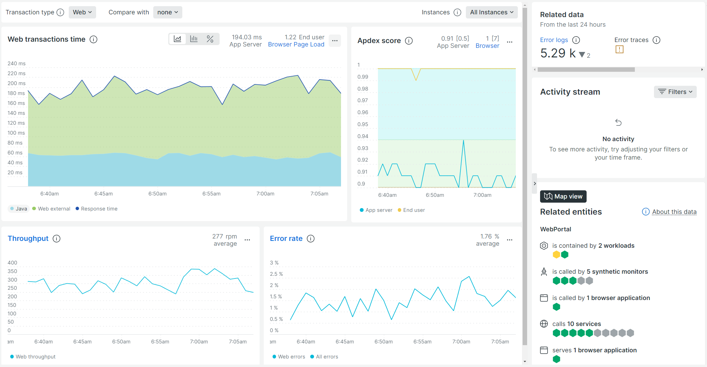
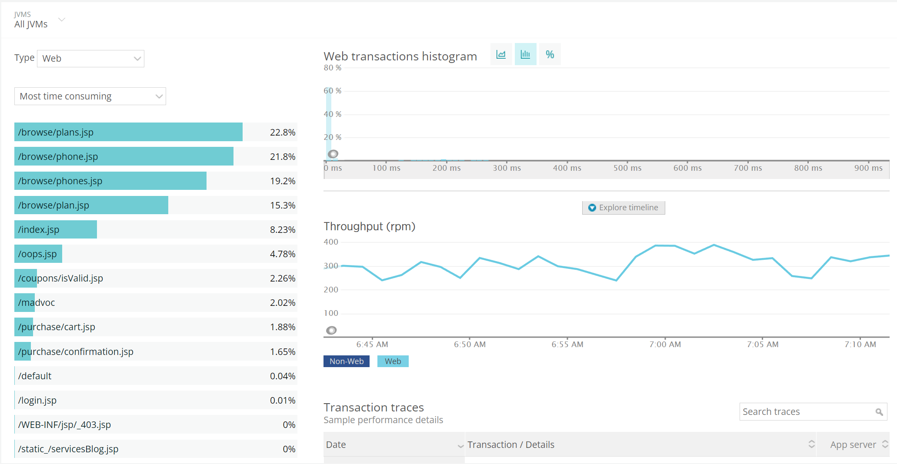
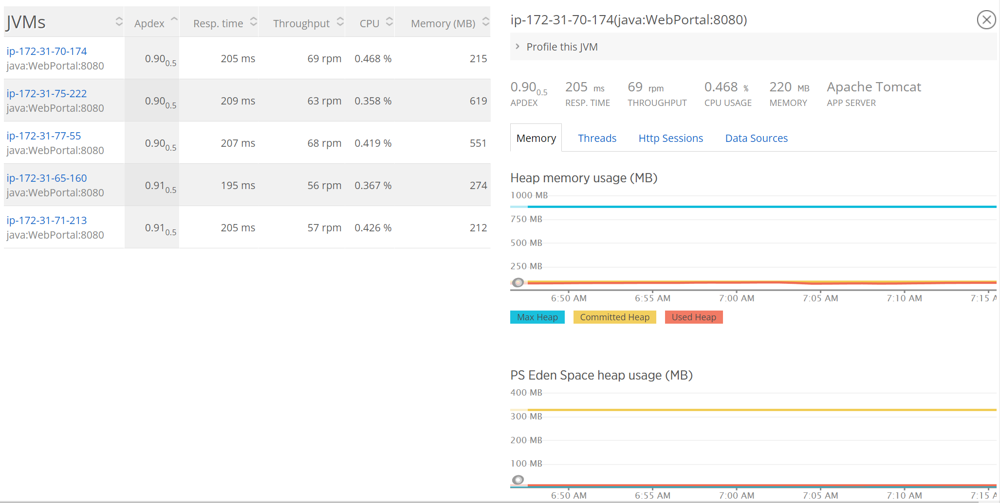

# Java Performance Monitoring

One of the most frustrating things for businesses is having to deal with slow-running applications. This can lead to a number of challenges, such as lost productivity, frustration among employees, and even lost business. There are a number of reasons why applications can run slowly, but often it boils down to poor performance management. Without the right tools in place, it can be difficult to identify and fix the underlying issues. As a result, businesses often find themselves dealing with the same problems over and over again. A great application performance management tool can be an ideal solution. By providing visibility into the inner workings of an application, it can help to identify and fix problems quickly and efficiently. As a result, businesses can avoid the frustrations and downfalls associated with slow-running applications.

## Why Is Java Application Performance Important?

Java is a versatile and powerful programming language that is widely used in a variety of industries. As such, it is essential for businesses to analyze and optimize their Java applications to ensure peak performance. Poorly performing Java applications can have a significant negative impact on various areas of the business, from customer satisfaction to employee productivity. In addition, slow or unreliable applications can increase operating costs and lead to lost revenues. There are a number of factors that can contribute to poor Java performance, including code optimization, inefficient algorithms, and inadequate hardware resources. By taking the time to analyze and improve Java application performance, businesses can reap a variety of benefits.

## What Can You Do To Improve Java Application Performance?

The types of things that can be done to improve Java application performance can be roughly broken into two categories: Java code optimization and Java application performance monitoring. These two categories are complementary, and work best when combined, but they can be discussed independently.

## Java Code Optimization

1. Avoid Recursion

[Recursion](https://en.wikipedia.org/wiki/Recursion_(computer_science)) is a common technique used to reduce a complex problem into a series of simple, repeated problems. In languages that support [tail call optimization](https://en.wikipedia.org/wiki/Tail_call), recursion can be fast and efficient. Unfortunately, Java is not one of these languages. As a result, recursion is an expensive operation. It may still be appropriate in some circumstances, but in most cases, you should opt for an iterative solution using loops over a recursive solution with Java.

2. Leverage StringBuilder

Java has a [rather dizzying array](https://www.javatpoint.com/string-concatenation-in-java) of options for building longer strings out of smaller pieces. One of the simplest of which is the `+=` operator.

```java
String thing = "thing";
thing += " 1";
thing += " 2";
thing += " 3";
```

The downside to this is that a Java `String` is immutable - it can not be changed. So the code above copies the first string into a buffer, and then adds the second string to the buffer, and uses that to create a new string. This repeated copying of memory is very expensive.

However, Java does provide an alternative with `StringBuilder` and `StringBuffer`. Both of these classes provide a String-like class that delivers many of the same capabilities, but they are also both mutable data structures. The only real difference between them is that `StringBuilder` is not synchronized, so it is not safe to use in multithreaded code unless you provide that syncrhoniation yourself, while `StringBuffer` is synchronized. This makes `StringBuilder` the fastest way to build large strings from smaller pieces.

```java
StringBuilder thing = new StringBuilder("thing");
thing.append(" 1");
thing.append(" 2");
thing.append(" 3");
```

3. Where Possible, Use Stack Allocations Instead of Heap Allocations

Java stores data in two different kinds of memory structure, the stack and the heap. The heap is what most programmers are most familiar with. It is a dynamically allocated pool of memory that is visible to all threads. It is where the JVM typically stores objects and classes. Anything that is inserted into the heap is subject to garbage collection, which means that when there is a large amount of data being stored in the heap, garbage collection cycles may take longer.

On the other hand, the stack is a fixed-size memory structure that is only visible to the current thread. It is where the JVM stores local variables and method parameters, and is where the JVM stores the stack frame for the current method. Data that is inserted into the stack enters it in a LIFO manner, meaning that the most recently inserted data is the first to be removed. Removal occurs when a method returns, and the stack frame is popped off the stack. Because of this structure where, the stack does not need to be garbage collected separately - data simply disappears when it's close is removed from the stack.

This helps to make items which are stored on the stack, like local variables and primitive types, quicker to access and to use. Java does not provide a programmer with explicit toolks for manipulating what goes onto the stack versus the heap, however, so the best that one can do is to remain aware of the difference, and to use primitive types in local variables as much as is reasonably possible.

4. Choose The Right Garbage Collector

This is a topic that can [readily fill an entire article](https://developers.redhat.com/articles/2021/11/02/how-choose-best-java-garbage-collector#choosing_a_garbage_collector) on its own. However, the key things to be aware of with Java performance is that the garbage collector that the JVM is using can be altered, and different garbage collectors have different design tradeoffs and areas of strength. Which garbage collector is the best for your application depends on the application and the environment, making it more difficult to pick a clear favorite at this time.

For single threaded software that can tolerate small, sometimes unpredictable pauses, particularly if it also generates small heaps, the Serial collector may be the best choice, while for multi-threaded software that needs to be responsive to user input, one of the newest garbage collectors, like the Z collector, should probably be the first choice. Each option has tradeoffs and areas of strength, and the best choice depends on the application and environment.

5. Identify and Fix Slow Critical Regions

A critical region is a region of code that is executed often. These areas are particularly sensitive to optimization, since the application spends a lot of time in these areas. Thus, it is important to identify and fix these areas.

That identification process, however, can be tricky. You may be left wondering how you find those critical areas that are good targets for optimization? The answer is to use a tool that gives you observability into your java application performance.

## Java Performance Monitoring and Observability

A tool that monitors, in real time, your Java application, and that provides both actionable insight into important data such as where the slow critical areas are, and the health of the JVMs running your application, as well as providing proactive alerting if something seems to be going wrong, is invaluable. [New Relic One](https://newrelic.com/signup) via the [New Relic Quickstart for Java](https://newrelic.com/instant-observability/java/3ebfb315-d0a6-4b27-9f89-b16a9a1ada5f) is such a tool.


New Relic One provides detailed high level views of your application's performance, , but it goes far beyond just that.

It provides  into the slowest transactions in your application, so that you can, in turn, optimize the portions of your code which are having the biggest effect on application performance.

It gives you , so that you can see what all of the JVMs that are running your application are doing, and it even provides built in JVM profiling and thread profiling, as well as detailed insights into your application's logs and errors, and myriad other things that collectively provide deep insight into your application's performance.

All of these features combine to deliver invaluable insight into your application's performance, and getting started with it is easy. You can [sign up for a free trial](https://newrelic.com/signup) for a free trial of New Relic One, and then you can add observability to your application via our [Quickstart for Java](https://newrelic.com/instant-observability/java/3ebfb315-d0a6-4b27-9f89-b16a9a1ada5f) in just a few simple steps. It will revolutionize how you see your application's performance, and give you the information that you need to make the most of your application.